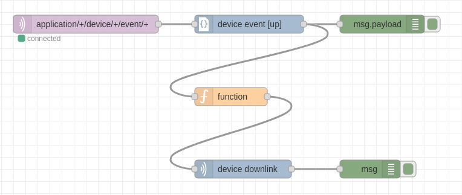

# Node-RED

[Node-RED](https://nodered.org/) provides a browser-based flow editor that makes
it easy to wire together flows using the wide range of nodes in the palette.

If you have installed the **chirpstack-gateway-os-full** image, then Node-RED
comes pre-installed with ChirpStack Gateway OS since v3.5.0, including the
[node-red-contrib-chirpstack](https://github.com/brocaar/node-red-contrib-chirpstack/)
package which provides several nodes to interact with ChirpStack.

## Enabling Node-RED

By default, Node-RED is disabled and must be enabled through the `gateway-config`
utility. In the root menu, select **Enable / disable applications** and then
**Enable Node-RED**. Note that once enabled, the option will change to
**Disable Node-RED**. Starting Node-RED will take some time (~ one minute).

## Access Node-RED

Once started, Node-RED is accessible in your browser on port
`http://[IP ADDRESS]:1880`. This means that if the IP address of your gateway
is `192.168.0.1`, that you can access Node-RED at `http://192.168.0.1:1880`.

### Building an echo flow



Below steps describe how to build an echo flow, which will enqueue the received
uplink from the device as downlink. While this probably doesn't cover a real
use-case, it does demonstrate how to receive uplink messages, process these
and schedule downlinks.

It is assumed that you already have setup your gateway and device. It is also
assumed that you have some basic knowledge about Node-RED.

#### Receive from MQTT

After opening Node-RED in your browser, first setup a **mqtt in** node. This
node will be used to receive device events that are published by the MQTT
broker that is running on the gateway (provided by the ChirpStack Gateway OS).

The following node properties must be set:

* Server:
	* Server: `localhost`
	* Port: `1883`
* Topic: `application/+/device/+/event/+`
* QoS: `0`
* Output: *auto-detect*

To test the connection to the MQTT broker, **Deploy** the flow. Under the newly
added node you should see a label *Connected*.

#### Parse events

Now that you are able to receive events from MQTT, setup a **device event**
node (you will find this node under the ChirpStack section). This node parses
the payloads generated by the **mqtt in** node to objects and it will perform
filtering based on event types.

The following node properties must be set:

* Event Type: *Uplink*

Connect the output side of the **mqtt in** node with the input side of the
**device event** node.

#### Debug events

For debugging, add a **debug** node and connect it to the **device event**
output and re-**Deploy** the flow. Open the debug messages tab in the Node-RED
interface. When one of your devices sends an uplink, you should see the uplink
event as debug message.

#### Echo payload function

To model the uplink event as downlink enqueue payload, add a **function** node
and connect the input to the output of the **device event** node.

The following node properties must be set:

**On Message**

```js
return {
    devEui: msg.payload.deviceInfo.devEui,
    fPort: msg.payload.fPort,
    confirmed: false,
    payload: msg.payload.data
};
```

This will make the **function** node output a message that can be used with the
**device downlink** node, which will be added in the next step.

#### Enqueue downlink

**Note:** For this step you need to obtain an API token from the ChirpStack
web-interface first!

To send the downlink message generated by the echo function to ChirpStack, add
a **device downlink** node and connect the input to the output of the
**function** node.

The following node properties must be set:

* Server: `localhost:8080`
* API token: *the API token obtained from the ChirpStack web-interface*
* Payload Encoding: *Base64*

#### Enqueue output (debug)

To view the message generated by the **device downlink** node, add an other
**debug** node and connect the input to the output of the **device downlink**
node.

The following node properties must be set:

* Output: *complete msg object*

#### Testing the flow

Make sure to re-**Deploy** the flow, so that all changes are deployed. When
sending an uplink frame, you should see two messages in the debug panel:

* The uplink event
* The response from the downlink enqueue

An example of the downlink enqueue output:

```
{"id": "c0768c9a-3ff3-4855-846c-7fdfa8894666", "_msgid": "a8264ce66a2c4830"}
```

**Note:** it is possible that the device receives the downlink after the next
uplink message.
