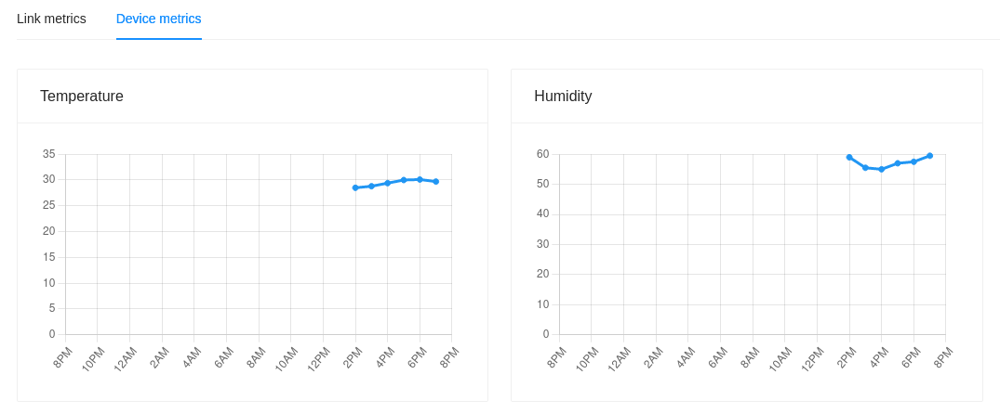

# TTN device depository and metrics

This guide explains how to import the TTN [lorawan-devices](https://github.com/TheThingsNetwork/lorawan-devices)
Device Repository and to how to visualize the decoded data directly within
the ChirpStack web-interface. In this guide we will use the [Tektelic Smart Room Sensor](https://tektelic.com/products/sensors/comfort-base-smart-room-sensor/)
as an example to visualize the temperature and humidity measurements, but it can
be easily substituted by any other device present in the repository.



<!-- toc -->

## TTN Device Repository

The TTN [lorawan-devices](https://github.com/TheThingsNetwork/lorawan-devices)
Device Repository contains information about many LoRaWAN devices. For most
devices a payload codec is included, which makes it really easy as you will
immediately see the decoded payload, rather than a binary blob.

ChirpStack provides support for importing this repository into the ChirpStack
database. Once imported, you will find the information about these devices
under [device-profile templates](../chirpstack/use/device-profile-templates.md).

### Importing

#### ChirpStack Gateway OS

If you are using the [ChirpStack Gateway OS](../chirpstack-gateway-os/index.md)
then you can skip this step. During the first boot of the ChirpStack Gateway OS
this repository will be automatically imported for you.

#### Docker Compose

If you are using the [ChirpStack Docker Compose](https://github.com/brocaar/chirpstack-docker)
example code, then you need to execute the following command to import the
repository:

```bash
make import-lorawan-devices
```

Note that this requires that you have the `make` and `git` commands installed.

#### Debian / Ubuntu

If you are have installed ChirpStack using the provided Debian / Ubuntu `.deb`
packages, then you need to execute the following command to import the
repository:

```bash
git clone https://github.com/TheThingsNetwork/lorawan-devices /tmp/lorawan-devices
chirpstack -c /etc/chirpstack import-ttn-lorawan-devices -d /tmp/lorawan-devices
```

## Connecting the device

### Create device-profile

[Log in](../chirpstack/use/login.md) into the ChirpStack web-interface and click
[Device profiles](../chirpstack/use/device-profiles.md) in the left menu. Then
click the **Add device-profile** button to add a new device profile.

Now that you have installed the TTN Device Repository, there is no need to fill
in all the fields by hand. Click the **Select device-profile template** button
instead, and select your device from this list. In case of the _Tektelic Smart
Room Sensor_, we would select:

_Tektelic Communications Inc. > Smart Room Sensor Base >  FW version: D > EU868_

Please make sure to select the template that matches your device and click **Ok**.
This will fill in all the required device-profile fields for you. Now create the
device-profile.

### Add device

Now add the device as you would normally add a device to ChirpStack. Make sure
to select the device-profile that you created in the previous step. Please
refer to the [Connecting a device](connect-device.md) guide for instructions
about connecting a device.

### Validation

Navigate to the device in the web-interface and click the **LoRaWAN frames** tab.
When you turn your device on, you should see a `JoinRequest` and `JoinAccept`
message appear. If this is not the case, then you might have entered the wrong
key(s). Please refer to the [Connecting a device](connect-device.md) guide for
troubleshooting instructions.

Once the device has been activated, navigate to the **Events** tab. Here you
will find a `join` event indicating that the device joined the network. As soon
as the devices sends its first measurements, you will see an `up` event. Open
this event by clicking on the **up** button. You will now see a JSON structure
containing the full payload. Confirm that it contains the decoded payload under
the `object` key (you will find this key under the `data` key).

In case of the Tektelic device, the content of the `object` looks like this:

```json
{
	relative_humidity: 59,
	ambient_temperature: 28.5,
	battery_voltage: 3.09
}
```

## Visualizing metrics

Once you have completed the previous steps, your device is up and running and
ChirpStack is able to decode the payloads. In this step we are going to
configure the measurements within ChirpStack. Once configured, ChirpStack will
start aggregating the received measurements and will visualize this on the
device page in the web-interface.

### Configure measurements

In the web-interface, navigate to the device-profile that you have created in
the previous steps and click the **Measurements** tab. You should see a few
configuration rows, with the data key and the measurement-kind set to
*Unknown / unset*. When a decoded uplink is received, ChirpStack will
automatically add measurements to the device-profile, so that you only have to
set the aggregation kind and give it a user-defined name. That is what we are
going to do in this step.

For the _Tektelic Smart Room Sensor_, we are going to configure the `ambient_temperature`
and `relative_humidity` measurements which were automatically added. If you
have a different device, then use the measurement keys that were added for you.

In case of the temperature and humidity, select the **Gauge** measurement type
and give the measurements a human-friendly name. For example _Room temperature_ and
_Room humidity_.

### View metrics

From the moment that you have configured the measurements, ChirpStack is going
aggregate the data. Data received before the measurements configuration is not
aggregated. Therefore it might take some time before data will appear. In case
of the *Tektelic Smart Room Sensor*, it will take up to 15 minutes before new
measurements are sent (with the default configuration).

In the web-interface, navigate to the device page. Within the **Dashboard**
tab, click the **Device metrics** tab. Here you will find the measurements
that you have just defined. You can switch between 24h (per hour), 31d (per day)
and 1y (per month) interval.
